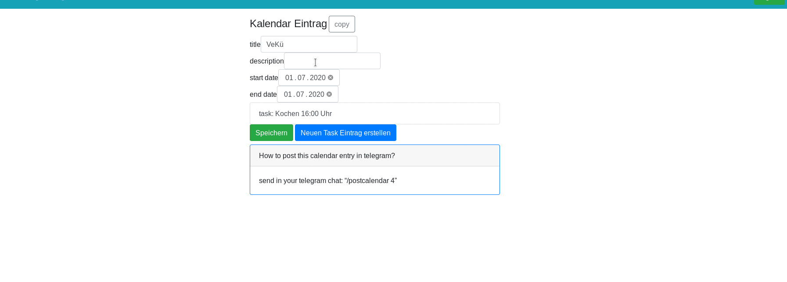
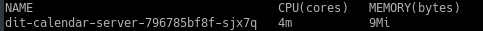

# dit-calendar-bot 

This is a tool for (collective) participatory/collaborative projects. A calendar with tasks for self-administration of work for groups. The main goal for this tool is to provide a calendar for events, create tasks for an event and allow a user-task assignment via [telegram](https://telegram.org/).

> :octocat: Alternatively,  [other calendars](https://github.com/dit-calendar/dit-calendar.github.io) are also supported.

you can create an event with tasks

and post it in your telegram group/channel, so a person can assign hirself

## how to use
To use this application in your telegram group, you must first complete following steps:
1. create an account on [dit-calendar-UI](https://dit-calendar.github.io/)
2. create a telegram Bot
   * start a conversation with [@Botfather](https://t.me/botfather) and write `/newbot`
   * give your Bot a name, maybe a nice picture and **please mention this website in your Bot description**
3. start the program for your telegram Bot by clicking on
     _(you need an account but it's free)_
   * it will build&start the program from the current source code
4. invite the new Bot to your telegram group/channel

Careful! **This application is still in beta** and will be further developed after some [feedback](https://github.com/dit-calendar/dit-calendar-bot/issues) from you. We will try to avoid code changes which will break an old version of a Bot. But we will only take the last release into account. If your Bot is already two versions behind, we don't promise compatibility.

### how to update
After this program is deployed to heroku it will not be updated automatically! If you are interested in more features, you should check out [new releases](https://github.com/dit-calendar/dit-calendar-bot/releases) from time to time.
To update your bot manually, you have to delete the program in heroku (under settings) and click on the heroku deploy button from step 3. again.

## resource usage

:deciduous_tree: All programs have been developed with resource-saving in mind.
* the application will sleep after some time if nobody is using it, and will wake up as soon as someone interacts with the UI or the Bot.
* The server currently requires 4 milliCPU and 9 Mb RAM

* the [dit-calendar-UI](https://dit-calendar.github.io/) size is about 50 Kb
* but the Bot still need improvement

# for developers

## config
* enable inline queries `https://core.telegram.org/bots/inline`

## deployment
* `gradle build`
* `heroku deploy:jar build/libs/dit-calendar-bot-*-all.jar --app dit-calendar`

## manual test
* https://core.telegram.org/bots/webhooks
* check bot status `https://api.telegram.org/bot{token}/getWebhookInfo`
* send message manually
 `curl -v -k -X POST -H "Content-Type: application/json" -H "Cache-Control: no-cache"  -d '{
 "update_id":10000,
 "message":{
   "date":1441645532,
   "chat":{
      "last_name":"Test Lastname",
      "id":1111111,
      "first_name":"Test",
      "username":"Test"
   },
   "message_id":1365,
   "from":{
      "last_name":"Test Lastname",
      "id":1111111,
      "first_name":"Test",
      "username":"Test"
   },
   "text":"/start"
 }
 }' "localhost:8443/"`

## source code for server and UI

### dit-calendar-server 
The backend is build on happstack in haskell.
https://github.com/dit-calendar/dit-calendar-server

### dit-calendar-ui 
Very simple web-ui written in elm. For creating events and tasks from the perspective of the organization group.
https://github.com/dit-calendar/dit-calendar-ui
